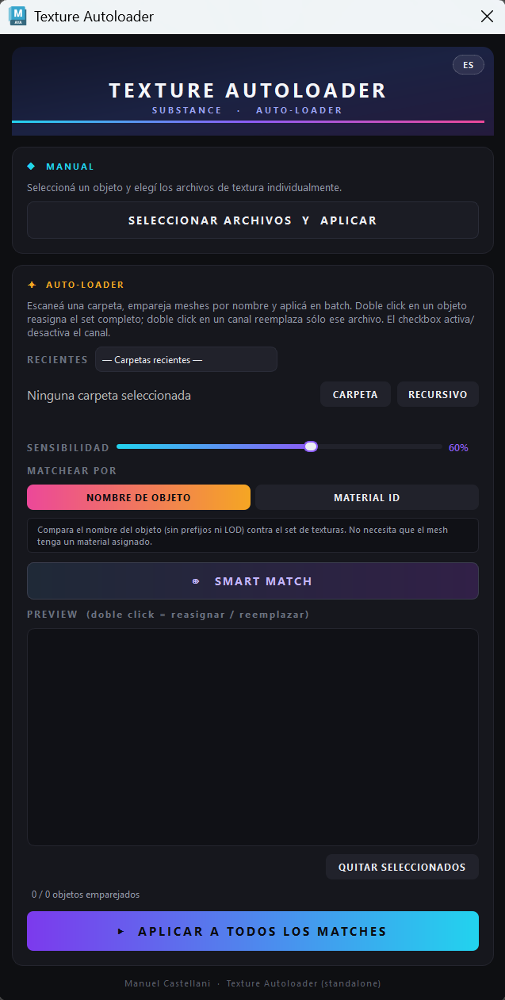
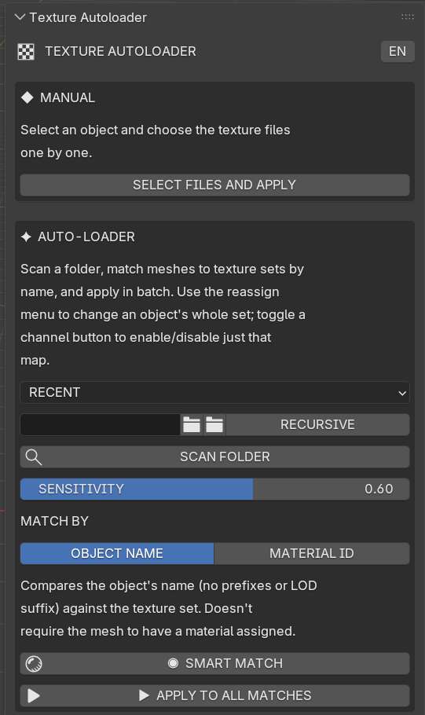

# Texture Autoloader

*[Read in English](README.md)*

Un auto-loader de texturas para Maya (Arnold) y Blender. Le apuntás a una
carpeta de texturas exportadas de Substance, y hace fuzzy-match de cada
mesh de la escena contra el set de texturas correcto — por nombre, o por
el material que ya tiene asignado — y te cablea el shader: un
`aiStandardSurface` en Maya, un grafo de nodos con Principled BSDF en
Blender.

Esta herramienta existe porque re-cablear redes de shading a mano
después de cada export de Substance es repetitivo, propenso a error, y
no escala más allá de un puñado de assets. Texture Autoloader convierte
"reconectar 8 mapas de textura por objeto, en 40 objetos" en "escanear
una carpeta, revisar los matches, click en Aplicar".

|                Maya                |               Blender                |
|:-----------------------------------:|:-------------------------------------:|
|  |  |

## Qué hace exactamente

1. **Escanea** una carpeta (opcionalmente recursiva) buscando archivos de
   textura, agrupándolos en sets por el nombre base del asset (quitando
   sufijos de tipo de mapa como `_BaseColor`, `_Roughness`, modificadores
   de resolución/UDIM, etc.).
2. **Matchea** cada mesh seleccionado contra un set de texturas, ya sea
   por el nombre del mesh o por el nombre del material que ya tiene
   asignado (con fallback automático a matching por nombre si el mesh
   todavía no tiene material propio). El matching es fuzzy (tolerante a
   typos/substrings) con un umbral de sensibilidad ajustable.
3. **Preview** del match por objeto y por canal, antes de tocar la
   escena — podés desactivar un canal que no querés, o reasignar a mano
   un set de texturas o un archivo puntual.
4. **Aplica**: crea un shader nuevo por objeto y cablea baseColor,
   roughness, metallic, normal, emission, ambient occlusion (multiplicado
   sobre base color), opacity y — sólo si lo activás — displacement.

## Por qué displacement es opt-in, y por qué la detección de UDIM tiene una lista negra

Dos decisiones que conviene conocer antes de usar esto en un asset real:

- **Displacement deforma la geometría real del render.** Cablear un mapa
  de height/displacement sin un scale ajustado a mano y sin subdivisión
  configurada en el mesh deja el objeto con aspecto "inflado". Esta
  herramienta detecta los mapas de displacement y los reporta, pero
  **no** los cablea a menos que actives explícitamente
  `enable_displacement_wiring` en el config.
- **La detección de UDIM está acotada a números de tile 1001–1999, con
  una lista negra de sufijos de resolución comunes** (512, 1024, 2048,
  4096, 8192, 16384). Sin esto, dos exports del mismo mapa en distinta
  resolución (ej. `Wall_BaseColor_1024.png` y `Wall_BaseColor_2048.png`)
  se leen como tiles UDIM por error, lo que rompe el tiling en el
  renderer.

Ambas decisiones salieron de encontrarme con el problema real en
producción, y están documentadas con más detalle en los comentarios del
código donde están implementadas.

## Estructura del repositorio

```
TextureAutoloader/
├── maya/
│   └── texture_autoloader_maya_standalone.py     # pegar en el Script Editor y correr — eso es todo
├── blender/
│   └── texture_autoloader_blender_standalone.py  # Install... este único archivo — eso es todo
├── advanced/                       # versión modular — ver "Versión avanzada / modular" abajo
│   ├── core/
│   │   └── texture_autoloader_core.py
│   ├── maya/
│   │   ├── texture_autoloader_maya.py
│   │   ├── install_shelf_button.py
│   │   └── tests/
│   ├── blender/
│   │   └── texture_autoloader_blender.py
│   └── tests/
├── LICENSE
└── .gitignore
```

Si solo querés usar la herramienta, todo lo que necesitás es el único
archivo en `maya/` o `blender/` de arriba — nada más en este repo te
importa. `advanced/` guarda una segunda versión, modular, de la misma
herramienta, pensada solamente para quien extienda o mantenga la lógica
de matching en sí; andá directo a
[Versión avanzada / modular](#versión-avanzada--modular) si sos vos,
si no, ignorá esa carpeta por completo.

## Instalación

### Maya

Abrí `maya/texture_autoloader_maya_standalone.py`, copiá el archivo
completo, pegalo en el Script Editor de Maya (pestaña Python) y corrélo
— la herramienta se abre al toque, sin diálogos, sin elegir ninguna
carpeta, nunca. Pegalo de nuevo cualquier vez que quieras volver a
abrirla. Su config/estado/log viven en la carpeta de preferencias de
usuario de Maya, no "al lado del script", porque un script pegado no
tiene una carpeta propia.

### Blender

En Blender: **Edit > Preferences > Add-ons > Install...**, elegí
`blender/texture_autoloader_blender_standalone.py`, activalo. Abrí el
Sidebar del Viewport 3D (tecla `N`) — hay una pestaña **Texture
Autoloader**.

Los dos archivos son completamente autocontenidos (un solo archivo, sin
importar nada del resto del repo) — eso es toda la instalación.

## Versión avanzada / modular

Todo lo que sigue de acá en adelante sólo importa si vas a modificar la
lógica de matching/naming en sí, querés que Maya y Blender queden
siempre perfectamente sincronizados en esa lógica, o querés correr la
suite de tests automatizada. Si solo querés usar la herramienta, no
necesitás nada de esto — ver Instalación arriba.

La versión modular vive en `advanced/`: `advanced/core/texture_autoloader_core.py`
**no depende de Maya, Blender, ni ningún toolkit de UI**. La
normalización de nombres, el fuzzy matching, el colapso de UDIM, el
agrupamiento por tipo de mapa, la persistencia de config/estado, el
logging y la tabla de traducciones inglés/español viven ahí,
compartidos entre los dos front-ends
(`advanced/maya/texture_autoloader_maya.py` y
`advanced/blender/texture_autoloader_blender.py`). Cada front-end sólo
agrega lo genuinamente específico de su aplicación: el cableado real de
nodos de shading, y la interfaz. Por eso las dos UIs nunca quedan
desincronizadas en los textos traducidos — leen de la misma tabla. Los
dos builds de un solo archivo en `maya/` y `blender/` incluyen esta
misma lógica copiada a mano, no generada automáticamente, así que un
cambio hecho acá hay que portarlo a mano también a esos archivos.

### Instalar la versión modular

**Maya** — mantené la estructura de carpetas de `advanced/` intacta
(`advanced/maya/texture_autoloader_maya.py` necesita a su hermana
`core/`) y ya sea agregá `advanced/maya/` a tu script path de Maya y
corré
```python
import texture_autoloader_maya as ta
ta.create_ui()
```
o usá el instalador de shelf de una sola vez,
`advanced/maya/install_shelf_button.py` (pegalo en el Script Editor y
corrélo una vez — te pide elegir la carpeta `TextureAutoloader/advanced`,
y agrega un botón al shelf para que las próximas veces sea un solo
click). **No pegues `advanced/maya/texture_autoloader_maya.py` directo
en el Script Editor** — depende de encontrar su carpeta hermana `core/`
en disco, algo que un script pegado no puede hacer; usá
`maya/texture_autoloader_maya_standalone.py` si querés pegar y correr.

**Blender** — mantené la estructura de carpetas del repo intacta y
cargá `advanced/blender/texture_autoloader_blender.py` como *script*
desde el Text Editor de Blender (Run Script), o agregá
`advanced/blender/` al path de `scripts/addons` de Blender vos mismo,
en vez de usar "Install..." directo sobre el archivo (el instalador de
un solo archivo de Blender copia sólo ese archivo, no su carpeta
hermana `core/`, y el addon falla con `RuntimeError: No module named
'texture_autoloader_core'` si lo intentás así). `advanced/blender/` y
`advanced/core/` necesitan seguir siendo carpetas hermanas.

## Configuración

La primera corrida crea `texture_autoloader_config.json` junto al script
que se está ejecutando, con valores por defecto razonables. Opciones
clave:

| Clave | Qué hace |
|---|---|
| `mesh_prefixes` | Prefijos de naming del estudio que se quitan antes de matchear (`SM_`, `SK_`, ...) |
| `match_threshold` | Sensibilidad de fuzzy-match por defecto (0.0–1.0); ajustable por sesión desde la UI |
| `match_mode` | `"object_name"` o `"material_id"` — estrategia de matching por defecto |
| `enable_udim_detection` | Desactivalo si tu convención de nombres genera falsos positivos de UDIM |
| `enable_displacement_wiring` | Apagado por defecto — ver arriba |
| `language` | `"en"` o `"es"` — idioma por defecto de la UI |
| `suffix_strip_list` / `map_types` | El vocabulario de tipos de mapa (baseColor, roughness, ...) — extendelo si tu preset de export de Substance usa otros sufijos |

Las preferencias de sesión personales (última carpeta usada, último
threshold, último modo de matching, idioma) se guardan aparte en
`texture_autoloader_state.json`, para que nunca pisen el config
compartido del estudio.

## Tests

Sólo la versión modular en `advanced/` tiene suite de tests automatizada
(los archivos standalone son copias hechas a mano y no se testean por
separado):

```bash
pip install pytest
pytest advanced/tests -v        # lógica del core, sin necesitar Maya/Blender/Qt
pytest advanced/maya/tests -v   # wrapper de Maya, no necesita Maya real instalado (trae stubs)
```

Por ahora no hay suite automatizada para el addon de Blender ni para
ninguna de las dos UIs (el diálogo de Qt, el panel de Blender) — ver
`advanced/tests/TESTING.md` y `advanced/maya/tests/TESTING.md` para el
detalle exacto de qué cubre cada una y por qué. Probar la UI y el
resultado real del shader todavía requiere el DCC de verdad.

## Limitaciones conocidas

- El fuzzy matching usa [rapidfuzz](https://github.com/rapidfuzz/rapidfuzz)
  si está instalado en el Python de tu Maya/Blender, y si no, cae al
  `difflib` de la librería estándar — sin auto-instalación, sin llamadas
  de red que vos no hayas pedido.
- El port de Blender es más nuevo que la versión de Maya y tiene menos
  uso real acumulado — reportá cualquier cosa rara que veas, en especial
  con UDIM y con nombres de sockets de nodos (Blender renombró algunos
  sockets del Principled BSDF entre versiones).
- Todavía no hay miniaturas de textura ni "guardar esta configuración de
  canales como preset por personaje" — ambas anotadas como próximos
  pasos razonables.

## Licencia

MIT — ver [LICENSE](LICENSE).
